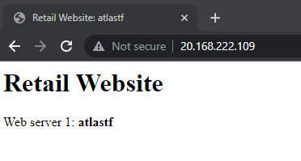

Tecnológico de Costa Rica.

Escuela de Ingeniería en Computación.

IC: 7602-Redes - 2 Semestre 2022.

2018086509 - Jocxan Sandi Batista.

2018145020 - José Daniel Acuña.

---

## Índice

- Infraestructura en Terraform.
  - Load balancer
  - DNS
  - VM del VPN
  - Seguridad
- Load balancer
- DNS
- VPN
- Web proxy cache
- Referencias

## Infraestructura en Terraform.

### Load Balancer

Crea un _azurerm_lb_ básico configurando su nombre, grupo de recursos e IP pública

```
resource "azurerm_lb" "lb" {
  name                = "${var.group}-load-balancer"
  location            = azurerm_resource_group.main.location
  resource_group_name = azurerm_resource_group.main.name
  sku                 = "Standard"

  frontend_ip_configuration {
    name                 = "${var.group}-lb-frontend-ip"
    public_ip_address_id = azurerm_public_ip.pip.id
  }
}
```

Adjunta el grupo de servicios de _back-end_ (estas son las IP privadas de las máquinas virtuales) para que el LB pueda redirigirlas

```
# Create backend pools
resource "azurerm_lb_backend_address_pool" "pool" {
  name            = "${var.group}-lb-backend-pool"
  loadbalancer_id = azurerm_lb.lb.id
}

resource "azurerm_network_interface_backend_address_pool_association" "backendpool" {
  count                   = 2
  network_interface_id    = element(azurerm_network_interface.neti.*.id, count.index)
  ip_configuration_name   = "ip-config${count.index + 1}"
  backend_address_pool_id = azurerm_lb_backend_address_pool.pool.id
}
```

Finalmente, agregamos una sonda y una regla para permitir el acceso al LB a través del puerto 80

```
resource "azurerm_lb_probe" "probe" {
  loadbalancer_id = azurerm_lb.lb.id
  name            = "${var.group}-lb-probe"
  protocol        = "Tcp"
  port            = 80
}

# Create a load balancer rule
resource "azurerm_lb_rule" "rule" {
  name                           = "${var.group}-lb-rule"
  loadbalancer_id                = azurerm_lb.lb.id
  protocol                       = "Tcp"
  frontend_port                  = 80
  backend_port                   = 80
  frontend_ip_configuration_name = "${var.group}-lb-frontend-ip"
  backend_address_pool_ids       = [azurerm_lb_backend_address_pool.pool.id]
}
```

### DNS

Empezamos por crear 3 zonas DNS usando el recurso _azurerm_dns_zone_ y les damos un _host name_

```
resource "azurerm_dns_zone" "asimov" {
  name                = "www.asimov.io"
  resource_group_name = azurerm_resource_group.main.name
}

resource "azurerm_dns_zone" "dostoievski" {
  name                = "www.dostoievski.io"
  resource_group_name = azurerm_resource_group.main.name
}

resource "azurerm_dns_zone" "google" {
  name                = "www.google.com"
  resource_group_name = azurerm_resource_group.main.name
}
```

Luego las mapeanos a la IP publica para que nos redirija al _Load Balancer_

```
resource "azurerm_dns_a_record" "asimov-record" {
  name                = "@"
  resource_group_name = azurerm_resource_group.main.name
  zone_name           = azurerm_dns_zone.asimov.name
  ttl                 = var.dns_ttl
  target_resource_id  = azurerm_public_ip.pip.id
}

resource "azurerm_dns_a_record" "dostoievski-record" {
  name                = "@"
  resource_group_name = azurerm_resource_group.main.name
  zone_name           = azurerm_dns_zone.dostoievski.name
  ttl                 = var.dns_ttl
  target_resource_id  = azurerm_public_ip.pip.id
}

resource "azurerm_dns_a_record" "google-record" {
  name                = "@"
  resource_group_name = azurerm_resource_group.main.name
  zone_name           = azurerm_dns_zone.dostoievski.name
  ttl                 = var.dns_ttl
  target_resource_id  = azurerm_public_ip.pip.id
}
```

### VM del VPN

Para automatizar la instalación del VPN se utilizo un **_provisioner_** que se conecta a la máquina virtual y ejecuta una serie de comandos.
Los cuales son:

1. Dar permisos a la carpeta en la que se va a trabajar.
2. Ir a la carpeta de trabajo.
3. Descargar un archivo de los comandos que hacen toda la instalación del VPN y Web proxy cache.
4. Cambia el string **IP_PUBLIC_MAQUINE_VIRTUAL** por la IP publica de la máquina.
5. Cambia el string **IP_PUBLIC_MAQUINE_VIRTUAL:3128** por la IP publica de la máquina.
6. Le da permisos al archivo para poder ejecutarse.
7. Ejecuta los comandos dentro del archivo.

```

provisioner "remote-exec" {
    inline = count.index < 2 ? [
      "chmod +x /home/azureuser/",
      "cd /home/azureuser/",
      "wget https://raw.githubusercontent.com/JocxanS7/Redes/master/comandos.sh",
      "sed -i 's/\"IP_PUBLIC_MAQUINE_VIRTUAL\"/\"${azurerm_public_ip.vm-pip.ip_address}\"/g' comandos.sh",
      "sed -i 's/\"IP_PUBLIC_MAQUINE_VIRTUAL:3128\"/\"${azurerm_public_ip.vm-pip.ip_address}:3128\"/g' comandos.sh",
      "sudo chmod +x /home/azureuser/comandos.sh",
      "bash /home/azureuser/comandos.sh"


    ] : null
    connection {
      type        = count.index < 2 ? "ssh" : null
      host        = count.index < 2 ? "${azurerm_public_ip.vm-pip.ip_address}" : null
      user        = count.index < 2 ? var.vm_cred.user : null
      private_key = count.index < 2 ? file("./ssh/id_rsa") : null
    }
```

### Seguridad

Tuvimos que configurar 3 reglas de entrada al SecurityGroup usando el recurso _security_rule_

- http:80
- https:443
- ssh:22

```
  security_rule {
    name                       = "http-in"
    priority                   = 103
    direction                  = "Inbound"
    access                     = "Allow"
    protocol                   = "Tcp"
    source_port_range          = "*"
    destination_port_range     = "80"
    source_address_prefix      = "*"
    destination_address_prefix = "*"
  }
  security_rule {
    name                       = "https-in"
    priority                   = 101
    direction                  = "Inbound"
    access                     = "Allow"
    protocol                   = "Tcp"
    source_port_range          = "*"
    destination_port_range     = "443"
    source_address_prefix      = "*"
    destination_address_prefix = "*"
  }
  security_rule {
    name                       = "ssh-in"
    priority                   = 102
    direction                  = "Inbound"
    access                     = "Allow"
    protocol                   = "Tcp"
    source_port_range          = "*"
    destination_port_range     = "22"
    source_address_prefix      = "*"
    destination_address_prefix = "*"
  }
```

## Load Balancer

Usando la IP publica actual *http://20.168.222.109/* podemos acceder a la pagina que esta caregada en las VMs a traves del LB, si refrescamos limpiando el cache del navegador es posible que nos redirija entre el _Web server 2_ o _Web server 1_



## DNS

Usamos el comando nslookup para probar el DNS

```
nslookup [domain-name] [name-server]
```

Por ejemplo si lo corremos sobre el dominio con alguno de los cuatro servidores que nos da a disposicion el _dns_zone_

```
nslookup www.asimov.io ns1-05.azure-dns.com.
```

Obtenemos el siguiente resultado en consola, que apunta a nuestro Load Balancer

```
PS C:\Users\atlas> nslookup www.asimov.io ns1-05.azure-dns.com.
Server:  UnKnown
Address:  2603:1061:0:700::5

Name:    www.asimov.io
Address:  20.168.222.109
```

## VPN

Se utilizo el cookbook 'openvpn', '~> 7.0.13'.

Se utilizo la siguiente configuración, además se encuentra el archivo que automatiza la instalación en ./vpn/comandos.sh:

```
"openvpn": {
        "gateway": "IP_PUBLIC_MAQUINE_VIRTUAL",
        "push_options": { "dhcp-option":  [ "DNS 8.8.8.8" ], "redirect-gateway": ["autolocal"] },
        "config": {
            "proto": "tcp",
            "port": "443"},
        "key": {"ca_expire": 3000}

    }
```

Además se creo un usuario para poder usar el vpn.

## Web proxy cache

No se puede probar porque se levanta el servicio en el puerto TCP6 3128.

Se utilizo el cookbook 'squid', '~> 4.4.5'.

Se utilizo la siguiente configuración además se encuentra el archivo que automatiza la instalación en ./vpn/comandos.sh:

```
"squid": {
        "config":{
            "dns_v4_first": true,
            "dns_nameservers": ["8.8.8.8", "8.8.4.4"],
            "ipv4": true,
            "ipv6": false,
            "ipv4_only": true,
            "port": "0.0.0.0:3128",
            "http_port": "0.0.0.0:3128",
            "http_access_deny_all": false,
            "localnets" : ["10.0.0.0/8", "172.16.0.0/12", "192.168.0.0/16"],
            "expire_policy": {
                "max_age": "3600"
            },
            "access_log": "/var/log/squid/access.log",
            "logformat": "squid",
            "custom_log_format": "%{%Y-%m-%dT%H:%M:%S}tl %6tr %>a %Ss/%03>Hs %<st %rm %ru %un %Sh/%<a %mt",
            "tcp_outgoing_address": "IP_PUBLIC_MAQUINE_VIRTUAL"
        }
    }

```

## Referencias

- Clase del Profesor Nereo Campos para realizar el VPN.
- [Chef supermarket - OpenVPN](https://supermarket.chef.io/cookbooks/openvpn)
- [Chef supermarket - Squid](https://supermarket.chef.io/cookbooks/squid)
- [Force Squid to connect to sites over IPv4 rather than IPv6](https://superuser.com/questions/994728/force-squid-to-connect-to-sites-over-ipv4-rather-than-ipv6)
- [How to Setup Squid Proxy Server on Ubuntu 18.04 & 16.04](https://tecadmin.net/setup-squid-proxy-server-on-ubuntu/)
- [Terraform - Provisioners](https://developer.hashicorp.com/terraform/language/resources/provisioners/syntax)
- [Terraform - Provisioner Connection Settings](https://developer.hashicorp.com/terraform/language/resources/provisioners/connection)
- [Terraform - remote-exec Provisioner](https://developer.hashicorp.com/terraform/language/resources/provisioners/remote-exec)
- [Quickstart: Create an Azure DNS zone and record using Terraform](https://learn.microsoft.com/en-us/azure/dns/dns-get-started-terraform?tabs=azure-cli)
- [Exercise - Create alias records for Azure DNS](https://learn.microsoft.com/en-us/training/modules/host-domain-azure-dns/6-exercise-create-alias-records)
